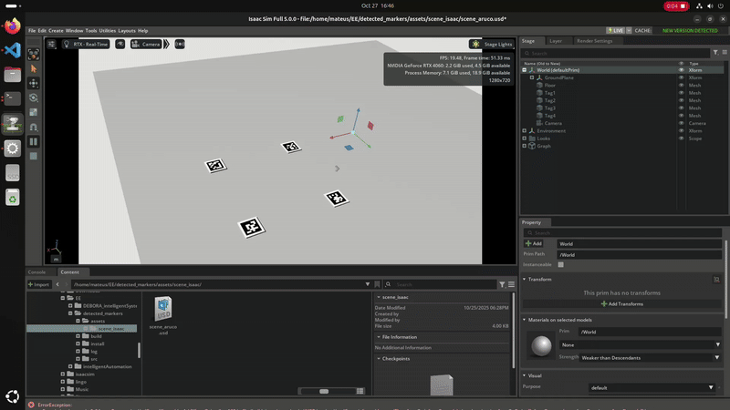

# Build Obstacles Footprint

> ROS2 Package for building scene obstacles footprint based on fiducial markers pose estimation.

This project implements a full pipeline of detecting AprilTag Markers in a scene (real or simulated) and dynamicly generate obstacles footprints based on polygons.  The system is design for allowing quickly creation of obstacles for mobile navigation tests, by simply arranging them on the scene floor.



## Architecture

The system is composed by three main components: 

### 1. Camera Node 

- Publishes the camera static transformation (`/tf` - `World` → `Camera`).
- Publish the camera stream (`/image_raw` and `/camera_info`).

### 2. Perception Pipeline

- `image_proc::RectifyNode`: Subscribes to `/image_raw` and  `/camera_info` and publishes the undistorted image (`/image_rect`).

- `apriltag_ros::AprilTagNode`: Subscribes to `/image_rect` and `/camera_info` and publish the 3D estimated poses of the detected (`\tf` - `Camera` → `tag...`).

### 3. Obstacle Footprint (Python Node)

- `polygon_builder_node`: Listens to the complete `/tf` tree, waiting for the (`World` → `tag...`) transforms to become available.

- Reads the `obstacles.yaml` file to group the tag poses into obstacles.

- Publishes the obstacles as `geometry_msgs/PolygonStamped` and `visualization_msgs/MarkerArray`.

## Dependencies

This projects depends on two packages: `apriltag-ros` and `image_pipeline`. To install it, execute: 

```
sudo apt install ros-jazzy-apriltag-ros ros-jazzy-image-common
```

